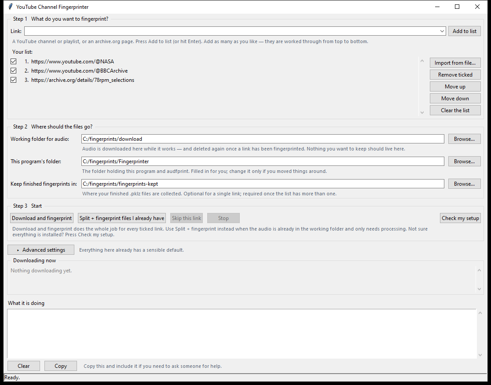
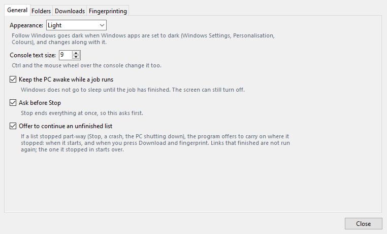

# Fingerprinter

[](https://github.com/EierkuchenHD/fingerprinter/stargazers)
[](https://github.com/EierkuchenHD/fingerprinter/network/members)
[](https://github.com/EierkuchenHD/fingerprinter/commits/main)
[](https://github.com/EierkuchenHD/fingerprinter/commits/main)

[](LICENSE)

Builds audio fingerprint databases (`.pklz` files) for identifying unknown
songs with [WerZatSong](https://github.com/Nel80s/WerZatSong) and
[WerZatSonGUI](https://github.com/LostwaveItalia/WerZatSonGUI).

Give it links to channels, playlists or single pages on YouTube, Archive.org,
Mixcloud, SoundCloud or [any other site yt-dlp
supports](https://github.com/yt-dlp/yt-dlp/blob/master/supportedsites.md). It
downloads the audio, splits long recordings, and fingerprints everything in
batches with WerZatSong's version of audfprint.

**Windows only.** Setup is a batch file, and the tools it installs are Windows
builds.



## Requirements

| Component | Used for | Installed by setup |
|---|---|---|
| Windows 10 or 11 | | |
| Python 3.10 or newer | Running the program and audfprint | Offered through winget, or install it from [python.org](https://www.python.org/downloads/windows/) |
| numpy, scipy, docopt, joblib, psutil | audfprint | Yes, with pip |
| [yt-dlp](https://github.com/yt-dlp/yt-dlp) | Downloading | Yes, with pip |
| ffmpeg and ffprobe | Reading lengths, splitting, decoding audio for audfprint | Yes, into `tools\ffmpeg` |
| Node.js | yt-dlp needs it to read YouTube pages | Yes, into `tools\node` |
| **WerZatSong's audfprint** | Making the fingerprints | Yes, into `audfprint\` |

### Why it has to be WerZatSong's audfprint

The Fingerprinter uses audfprint as shipped with WerZatSong:
[Nel80s/WerZatSong, `libs/audfprint`](https://github.com/Nel80s/WerZatSong/tree/main/libs/audfprint).
The original [dpwe/audfprint](https://github.com/dpwe/audfprint) does **not**
work as a replacement. On Windows it:

- prints every file name it reads in the console's code page, so a title with
  characters outside it (`＂`, `？`, Japanese, and so on) crashes the batch;
- reads the file lists this program writes in that same code page, so any
  non-ASCII path comes back as "file not found";
- rejects audio files that carry cover art, which many downloads do.

WerZatSong's copy fixes all three, and it is the audfprint WerZatSong and
WerZatSonGUI search with. Setup installs it for you, and Check setup flags an
upstream copy and offers to replace it.

## Setup

1. Download `Fingerprinter-<version>.zip` from the latest
   [release](https://github.com/EierkuchenHD/fingerprinter/releases) and unzip
   it somewhere permanent, for example `C:\fingerprints\Fingerprinter`.
   Pre-releases are test versions; see the [changelog](CHANGELOG.md).
2. Double-click **`setup.bat`**. It:
   - finds Python 3.10 or newer. If there is none, it offers to install Python
     3.13 with winget, or opens python.org when winget is not available;
   - checks every other component by actually running it, lists anything
     missing or broken, and installs it once you confirm.
3. Start **`yt-fingerprinter.pyw`**. Setup offers to start it for you.

Running `setup.bat` again is safe: anything that already works is left alone.
The program also checks its components each time it starts, and offers to
install anything that has gone missing.

### What gets installed, and where

- **Python packages and yt-dlp:** into the Python that runs the program, with
  pip.
- **ffmpeg and Node.js:** into `tools\` in the program folder, and only when a
  working copy is not already on PATH. No admin rights or PATH changes are
  needed; the program puts `tools\` first on its own PATH. They come from
  gyan.dev (the ffmpeg essentials build) and nodejs.org (the current LTS), and
  each download is checked against its published SHA-256 before it is unpacked.
- **WerZatSong's audfprint:** into `audfprint\` in the program folder. An
  existing folder there is renamed to `audfprint.old`, not deleted.

### Installing by hand instead

```bat
pip install -r requirements.txt yt-dlp
```

Then put ffmpeg (for example from [gyan.dev](https://www.gyan.dev/ffmpeg/builds/))
and Node.js LTS on PATH, and copy WerZatSong's `libs\audfprint` folder into the
program folder so that `audfprint\audfprint.py` exists. GitHub's ZIP adds an
extra top-level folder, so check that the file is not one level too deep.

## Using it

1. Paste a link into the **Link** box and press **Add** (or Enter). Add as many
   as you like, or use **Import...** for a text file with one link per line.
2. Press **Download and fingerprint**.

The folders are already set: audio downloads to `downloads\` and
finished fingerprints are kept in `pklz-files\`, both in the program folder.
The status bar at the bottom always shows where fingerprints go; click it to
open that folder, and change it in **Settings** if you want them elsewhere.

The window has three panels, and the dividers between them can be dragged:

- **Your list**, on the left. Drag a row by its `≡` handle to move it, click a
  link to open it in your browser, untick a row to skip it this time, and click
  **✕** to remove it. Right-click a row to open or copy the link, count again,
  move it to the top or bottom, or remove it. Each row shows how many videos
  the channel or playlist has; the program counts them in the background when a
  link is added, and again once a day, and a large channel takes a minute or so.
- **Now**, on the right: which link is running, what it is doing (listing,
  downloading, splitting or fingerprinting) with a progress bar and a rough
  time left, and a row for each download or fingerprint batch under way.
- **Console**, along the bottom: everything that happens, in detail.

Hover over a control to see what it does.

It does not stop to ask anything: for each link it logs how many items it found
and a rough size and time estimate, then starts. Press **Stop** if the numbers
are more than you expected.

Finished `.pklz` files are named after the channel handle in the link (for
example `@name-1.pklz`), or after the uploader. Nothing in the fingerprints
folder is ever deleted: if a name is already taken, the new file gets `_2`,
`_3` and so on.

**Pause** freezes whatever is running (downloads, splitting and
fingerprinting) and starts nothing new until you press **Resume**; it then
carries on from the same point. A download paused for a long time may lose its
connection, in which case yt-dlp retries and continues from its partial file.
**Skip link** moves on to the next link once the current stage finishes.
**Stop** ends everything immediately.

### Running a channel again

Turn on **Skip items already fingerprinted in an earlier run** (Settings,
Downloads). Every item is then remembered once its link has been fingerprinted,
and the next run of that channel only downloads what is new. An item is only
remembered after its whole link succeeds, so a failed run never marks anything
as done. **Forget them** clears the list.

### Audio you already have

The **Audio on disk** menu has two choices. Both work on the working folder
without downloading anything, and both ask before they start:

- **Split + fingerprint** splits long files first (see below), then
  fingerprints.
- **Fingerprint only** uses the files as they are and skips reading their
  lengths, which saves a long wait on a collection that is already split.

These are also the way to resume after a crash. Neither empties `work\pklz`,
where unfinished `.pklz` files wait, and work that is already fingerprinted is
recorded in `work\pklz\fingerprinted.json` and not done twice.

## Splitting

Files longer than **12 minutes** are split into **6-minute** pieces. The last
piece takes the remainder, so a 15-minute file becomes 6:00 + 9:00 and a
30-minute file becomes five 6:00 pieces. Files of 12 minutes or less are left
whole, so with splitting on, nothing longer than 12 minutes is fingerprinted.

This makes a match point to a 6-minute window of a long mix instead of "somewhere
in these three hours". Six minutes is the minimum because shorter pieces give
audfprint less to match on. Pieces are cut by copying the audio stream, without
re-encoding.

Splitting is on by default for downloads (**Settings**, Fingerprinting). The
two **Audio on disk** choices decide it for themselves.

## Settings

Settings and the list are saved to `config.json` when you close the program.
The defaults suit most jobs, but check them before a large one: they decide
memory use, download speed and how big the output files are.

### Downloads at once

In the toolbar. Default **8**, maximum 32. Each download is a separate yt-dlp
process. More is faster on a good connection but uses more bandwidth and CPU,
and sites limit how fast one client may fetch: if downloads start failing with
HTTP 429 (too many requests) or 403, lower it.

### The Settings window



| Tab | Setting | Default | What it does |
|---|---|---|---|
| Folders | Working folder for audio | `downloads\` | Where audio is downloaded. Each link's audio is deleted once it is fingerprinted, so keep nothing else in it. |
| Folders | Keep finished fingerprints in | `pklz-files\` | Where finished `.pklz` files are collected. Nothing in it is ever deleted. |
| Folders | This program's folder | filled in | The folder that holds this program and its `audfprint\`. |
| Downloads | Name downloaded files | `%(title)s [%(id)s].%(ext)s` | A yt-dlp [output template](https://github.com/yt-dlp/yt-dlp#output-template). |
| Downloads | Extra download options | empty | Passed to yt-dlp as they are. |
| Downloads | Sign in with cookies from | None | A browser whose login yt-dlp uses. See [Content that needs a login](#content-that-needs-a-login). |
| Downloads | Skip items shorter than / longer than | 0 (no limit) | Leaves out items by length, in seconds and minutes. 60 seconds leaves out YouTube Shorts. |
| Downloads | Skip items already fingerprinted in an earlier run | Off | See [Running a channel again](#running-a-channel-again). |
| Downloads | Show every line of download output | Off | Adds everything yt-dlp and audfprint print to the console. Useful when a download fails; otherwise it floods the console. Locked while a job runs. |
| Downloads | Open the audio folder when a link starts | On | |
| Fingerprinting | Fingerprint jobs at once | 4 | How many audfprint processes work at the same time. A link with fewer recordings than Recordings per file is one batch; from 40 files, the jobs share it and their work is merged into one `.pklz`. Each job can use up to about 5.5 GB of memory, so raise it only if you have the RAM and CPU cores. |
| Fingerprinting | Recordings per file | 1000 | How many recordings go into one `.pklz`. Keep it high: a matcher loads every `.pklz` on each search, so many small files slow every search. |
| Fingerprinting | Split long recordings after downloading | On | See [Splitting](#splitting). |
| Fingerprinting | Open the fingerprints folder when a run finishes | On | |
| Fingerprinting | Play a sound and flash the taskbar button when a run finishes | On | |

audfprint's own `--ncores` is fixed at 1 on purpose: several single-core jobs
are faster than one job spread over several cores (measured: 8 jobs at 1 core
took 28 s for what 1 job at 8 cores took 59 s).

## Troubleshooting

Press **Check setup** first. It:

- checks every component by running it: Python, the Python packages, yt-dlp,
  ffmpeg, ffprobe, Node.js, and whether `audfprint\` is WerZatSong's version and
  starts;
- runs `yt-dlp -U`, which **updates yt-dlp** if it can (this can take up to
  90 seconds);
- fetches one YouTube video's details as a test;
- checks free space and write access in the working folder;
- offers to install or repair whatever is missing or not working, and says what
  it will do first.

| Problem | Cause and fix |
|---|---|
| "WerZatSong's audfprint is needed" | `audfprint\` is missing, one folder too deep, or the upstream version. Press Check setup to install the right one. |
| `setup.bat` says Python was not found | Install Python from python.org with **Add python.exe to PATH** ticked, then run `setup.bat` again. |
| An install fails | The console shows why (no connection, proxy, antivirus) and how to do that part by hand. |
| Many downloads fail, HTTP 429 or 403 | The site is rate-limiting you. Lower **Downloads at once** and try again later. |
| Some items are skipped | Private, members-only, age-restricted or blocked in your country. The console gives the reason for each. |
| The downloaded audio is gone | Expected: it is deleted once a link is fingerprinted. |
| A run seems frozen | Big channels take a while to list; **Now** shows how many entries have been found so far. For more detail, turn on **Show every line of download output** (Settings, Downloads). |

### Content that needs a login

In Settings, Downloads, choose your browser under **Sign in with cookies from**,
and close that browser before starting; Firefox works most reliably. yt-dlp
then uses that browser's login. It reads the cookies of the Windows
account the program runs under, so it does not work from a scheduled task or a
service, whose account has no browser profile.

## Limitations

- **Windows only.**
- **Downloaded audio is deleted** once each link is fingerprinted. The `.pklz`
  files are the output; keep your own copy of the audio if you want it.
- **Download and fingerprint empties `work\`** before each link, without
  asking, including the record of finished work. A `.pklz` an interrupted run
  left there is moved to your fingerprints folder as `recovered-...` rather
  than deleted. To resume an interrupted run instead, use one of the buttons
  for audio already on disk.
- **If a link's download folder already holds files** from an earlier attempt,
  the program asks whether to delete them, and answers "yes" itself after two
  minutes so an unattended list never stalls. The working folder should hold
  nothing of yours.
- **Estimates are rough.** Size and time depend on bitrate, length and your
  connection.

## Files and folders

| In the program folder | |
|---|---|
| `yt-fingerprinter.pyw` | The program. |
| `setup.bat`, `dependencies.py` | Setup, and the component check and installer that the program also uses. |
| `audfprint_quiet.py` | Runs audfprint with its ffmpeg console windows hidden. |
| `audfprint\` | WerZatSong's audfprint (installed by setup). |
| `tools\` | ffmpeg and Node.js, if setup installed them. |
| `downloads\` | The default working folder. Each link downloads into its own subfolder here, deleted once it is fingerprinted. |
| `pklz-files\` | The default place finished fingerprints are kept. Nothing in it is deleted. |
| `work\` | The program's scratch space: file lists for audfprint and unfinished `.pklz` files. |
| `config.json`, `recent_urls.json` | Your settings, list and recent links. |
| `fingerprinted-items.txt` | Items already fingerprinted, when that setting is on. The format of yt-dlp's `--download-archive`. |
| `CHANGELOG.md` | What changed in each version. |

## Credits

Fingerprinting is done by [audfprint](https://github.com/dpwe/audfprint) by Dan
Ellis, in the version maintained with [WerZatSong](https://github.com/Nel80s/WerZatSong)
by Nel, and downloading by [yt-dlp](https://github.com/yt-dlp/yt-dlp). This
project is the window around them.

Only download and store material you have the right to. This tool does not
decide that for you.

## License

[MIT](LICENSE). This covers this project only. audfprint, WerZatSong and yt-dlp
are separate projects under their own licences.
