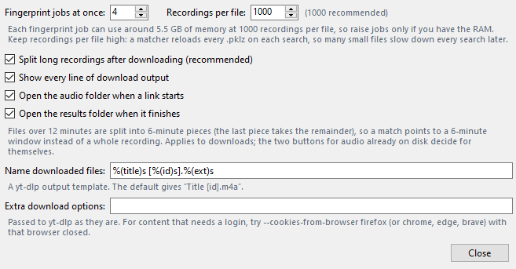

# Fingerprinter

[](https://github.com/EierkuchenHD/fingerprinter/stargazers)
[](https://github.com/EierkuchenHD/fingerprinter/network/members)
[](https://github.com/EierkuchenHD/fingerprinter/commits/main)
[](https://github.com/EierkuchenHD/fingerprinter/commits/main)

[](LICENSE)

Builds audio fingerprint databases (`.pklz` files) for identifying unknown
songs with [WerZatSong](https://github.com/Nel80s/WerZatSong) and WerZatSonGUI.

Give it links to channels, playlists or single pages on YouTube, Archive.org,
Mixcloud, SoundCloud or [any other site yt-dlp
supports](https://github.com/yt-dlp/yt-dlp/blob/master/supportedsites.md). It
downloads the audio, splits long recordings, and fingerprints everything in
batches with WerZatSong's version of audfprint.

**Windows only.** Setup is a batch file, and the tools it installs are Windows
builds.


## Requirements

| Component | Used for | Installed by setup |
|---|---|---|
| Windows 10 or 11 | | |
| Python 3.10 or newer | Running the program and audfprint | Offered through winget, or install it from [python.org](https://www.python.org/downloads/windows/) |
| numpy, scipy, docopt, joblib, psutil | audfprint | Yes, with pip |
| [yt-dlp](https://github.com/yt-dlp/yt-dlp) | Downloading | Yes, with pip |
| ffmpeg and ffprobe | Reading lengths, splitting, decoding audio for audfprint | Yes, into `tools\ffmpeg` |
| Node.js | yt-dlp needs it to read YouTube pages | Yes, into `tools\node` |
| **WerZatSong's audfprint** | Making the fingerprints | Yes, into `audfprint\` |

### Why it has to be WerZatSong's audfprint

The Fingerprinter uses audfprint as shipped with WerZatSong:
[Nel80s/WerZatSong, `libs/audfprint`](https://github.com/Nel80s/WerZatSong/tree/main/libs/audfprint).
The original [dpwe/audfprint](https://github.com/dpwe/audfprint) does **not**
work as a replacement. On Windows it:

- prints every file name it reads in the console's code page, so a title with
  characters outside it (`＂`, `？`, Japanese, and so on) crashes the batch;
- reads the file lists this program writes in that same code page, so any
  non-ASCII path comes back as "file not found";
- rejects audio files that carry cover art, which many downloads do.

WerZatSong's copy fixes all three, and it is the audfprint WerZatSong and
WerZatSonGUI search with. Setup installs it for you, and Check setup flags an
upstream copy and offers to replace it.

## Setup

1. Download `Fingerprinter-<version>.zip` from the latest
   [release](https://github.com/EierkuchenHD/fingerprinter/releases) and unzip
   it somewhere permanent, for example `C:\fingerprints\Fingerprinter`.
   Pre-releases are test versions; see the [changelog](CHANGELOG.md).
2. Double-click **`setup.bat`**. It:
   - finds Python 3.10 or newer. If there is none, it offers to install Python
     3.13 with winget, or opens python.org when winget is not available;
   - checks every other component by actually running it, lists anything
     missing or broken, and installs it once you confirm.
3. Start **`yt-fingerprinter.pyw`**. Setup offers to start it for you.

Running `setup.bat` again is safe: anything that already works is left alone.
The program also checks its components each time it starts, and offers to
install anything that has gone missing.

### What gets installed, and where

- **Python packages and yt-dlp:** into the Python that runs the program, with
  pip.
- **ffmpeg and Node.js:** into `tools\` in the program folder, and only when a
  working copy is not already on PATH. No admin rights or PATH changes are
  needed; the program puts `tools\` first on its own PATH. They come from
  gyan.dev (the ffmpeg essentials build) and nodejs.org (the current LTS), and
  each download is checked against its published SHA-256 before it is unpacked.
- **WerZatSong's audfprint:** into `audfprint\` in the program folder. An
  existing folder there is renamed to `audfprint.old`, not deleted.

### Installing by hand instead

```bat
pip install -r requirements.txt yt-dlp
```

Then put ffmpeg (for example from [gyan.dev](https://www.gyan.dev/ffmpeg/builds/))
and Node.js LTS on PATH, and copy WerZatSong's `libs\audfprint` folder into the
program folder so that `audfprint\audfprint.py` exists. GitHub's ZIP adds an
extra top-level folder, so check that the file is not one level too deep.

## Using it

1. **Step 1:** paste a link and press **Add to list** (or Enter). Add as many
   as you like, or use **Import from file** for a text file with one link per
   line. Untick a row to skip it this time.
2. **Step 2:** choose the **Working folder for audio**. With more than one link
   in the list, also set **Keep finished fingerprints in** (see
   [Limitations](#limitations)).
3. **Step 3:** press **Download and fingerprint** and follow the **Console**.

It does not stop to ask anything: for each link it logs how many items it found
and a rough size and time estimate, then starts. Press **Stop** if the numbers
are more than you expected.

Finished `.pklz` files go to **Keep finished fingerprints in**, or to
`pklz-files\` in the program folder if that is empty. They are named after the
channel handle in the link (for example `@name-1.pklz`), or after the
uploader.

**Skip this link** moves on to the next link once the current stage finishes.
**Stop** ends everything immediately.

### Audio you already have

Both buttons under **Audio already on disk** work on the working folder without
downloading anything, and neither clears the results folder:

- **Split + fingerprint** splits long files first (see below), then
  fingerprints.
- **Fingerprint only** uses the files as they are and skips reading their
  lengths, which saves a long wait on a collection that is already split.

These are also the way to resume after a crash: work that is already
fingerprinted is recorded in `fingerprinted.json` next to the `.pklz` files and
is not done twice.

## Splitting

Files longer than **12 minutes** are split into **6-minute** pieces. The last
piece takes the remainder, so a 15-minute file becomes 6:00 + 9:00 and a
30-minute file becomes five 6:00 pieces. Files of 12 minutes or less are left
whole, so with splitting on, nothing longer than 12 minutes is fingerprinted.

This makes a match point to a 6-minute window of a long mix instead of "somewhere
in these three hours". Six minutes is the minimum because shorter pieces give
audfprint less to match on. Pieces are cut by copying the audio stream, without
re-encoding.

Splitting is on by default for downloads (**Advanced settings**). The two
buttons for audio already on disk decide it for themselves.

## Settings

Settings and the list are saved to `config.json` when you close the program.
The defaults suit most jobs, but check them before a large one: they decide
memory use, download speed and how big the output files are.

### Downloads at once

In Step 3. Default **8**, maximum 32. Each download is a separate yt-dlp
process. More is faster on a good connection but uses more bandwidth and CPU,
and sites limit how fast one client may fetch: if downloads start failing with
HTTP 429 (too many requests) or 403, lower it.

### Advanced settings



| Setting | Default | What it does |
|---|---|---|
| Fingerprint jobs at once | 4 | Batches fingerprinted side by side. Each can use around 5.5 GB of memory at 1000 recordings per file, so raise it only if you have the RAM. |
| Recordings per file | 1000 | How many recordings go into one `.pklz`. Keep it high: a matcher loads every `.pklz` on each search, so many small files slow every search. |
| Split long recordings after downloading | On | See [Splitting](#splitting). |
| Show every line of download output | On | yt-dlp's full output in the console. Useful when a download fails. |
| Open the audio folder when a link starts | On | |
| Open the results folder when it finishes | On | |
| Name downloaded files | `%(title)s [%(id)s].%(ext)s` | A yt-dlp [output template](https://github.com/yt-dlp/yt-dlp#output-template). |
| Extra download options | empty | Passed to yt-dlp as they are. See [Content that needs a login](#content-that-needs-a-login). |

audfprint's own `--ncores` is fixed at 1 on purpose: several single-core jobs
are faster than one job spread over several cores (measured: 8 jobs at 1 core
took 28 s for what 1 job at 8 cores took 59 s).

## Troubleshooting

Press **Check setup** first. It:

- checks every component by running it: Python, the Python packages, yt-dlp,
  ffmpeg, ffprobe, Node.js, and whether `audfprint\` is WerZatSong's version and
  starts;
- runs `yt-dlp -U`, which **updates yt-dlp** if it can (this can take up to
  90 seconds);
- fetches one YouTube video's details as a test;
- checks free space and write access in the working folder;
- offers to install or repair whatever is missing or not working, and says what
  it will do first.

| Problem | Cause and fix |
|---|---|
| "WerZatSong's audfprint is needed" | `audfprint\` is missing, one folder too deep, or the upstream version. Press Check setup to install the right one. |
| `setup.bat` says Python was not found | Install Python from python.org with **Add python.exe to PATH** ticked, then run `setup.bat` again. |
| An install fails | The console shows why (no connection, proxy, antivirus) and how to do that part by hand. |
| Many downloads fail, HTTP 429 or 403 | The site is rate-limiting you. Lower **Downloads at once** and try again later. |
| Some items are skipped | Private, members-only, age-restricted or blocked in your country. The console gives the reason for each. |
| A list gave far fewer results than expected | **Keep finished fingerprints in** was empty, so each link overwrote the previous one. |
| The downloaded audio is gone | Expected: it is deleted once a link is fingerprinted. |
| A run seems frozen | Big channels take a while to list. Turn on **Show every line of download output** to see progress. |

### Content that needs a login

Add this to **Extra download options**, with `chrome`, `edge` or `brave` in
place of `firefox` if needed, and close that browser first:

```
--cookies-from-browser firefox
```

yt-dlp then uses that browser's login. It reads the cookies of the Windows
account the program runs under, so it does not work from a scheduled task or a
service, whose account has no browser profile.

## Limitations

- **Windows only.**
- **Downloaded audio is deleted** once each link is fingerprinted. The `.pklz`
  files are the output; keep your own copy of the audio if you want it.
- **The results folder is emptied before each link.** With more than one link,
  set **Keep finished fingerprints in**, or only the last link's fingerprints
  are left. The program warns before starting a list without it.
- **Download and fingerprint clears the results folder** and its record of
  finished work. To resume an interrupted run, use one of the buttons for audio
  already on disk.
- **The "folder is not empty" prompt answers itself** with "yes, delete" after
  two minutes, so an unattended list never stalls on it. Move anything you want
  to keep beforehand.
- **Estimates are rough.** Size and time depend on bitrate, length and your
  connection.

## Files and folders

| In the program folder | |
|---|---|
| `yt-fingerprinter.pyw` | The program. |
| `setup.bat`, `dependencies.py` | Setup, and the component check and installer that the program also uses. |
| `audfprint_quiet.py` | Runs audfprint with its ffmpeg console windows hidden. |
| `audfprint\` | WerZatSong's audfprint (installed by setup). |
| `tools\` | ffmpeg and Node.js, if setup installed them. |
| `pklz-files\` | Results, when no destination is set. |
| `texts\` | File lists for audfprint. Cleared before fingerprinting. |
| `config.json`, `recent_urls.json` | Your settings, list and recent links. |
| `CHANGELOG.md` | What changed in each version. |

## Credits

Fingerprinting is done by [audfprint](https://github.com/dpwe/audfprint) by Dan
Ellis, in the version maintained with [WerZatSong](https://github.com/Nel80s/WerZatSong)
by Nel, and downloading by [yt-dlp](https://github.com/yt-dlp/yt-dlp). This
project is the window around them.

Only download and store material you have the right to. This tool does not
decide that for you.

## License

[MIT](LICENSE). This covers this project only. audfprint, WerZatSong and yt-dlp
are separate projects under their own licences.
